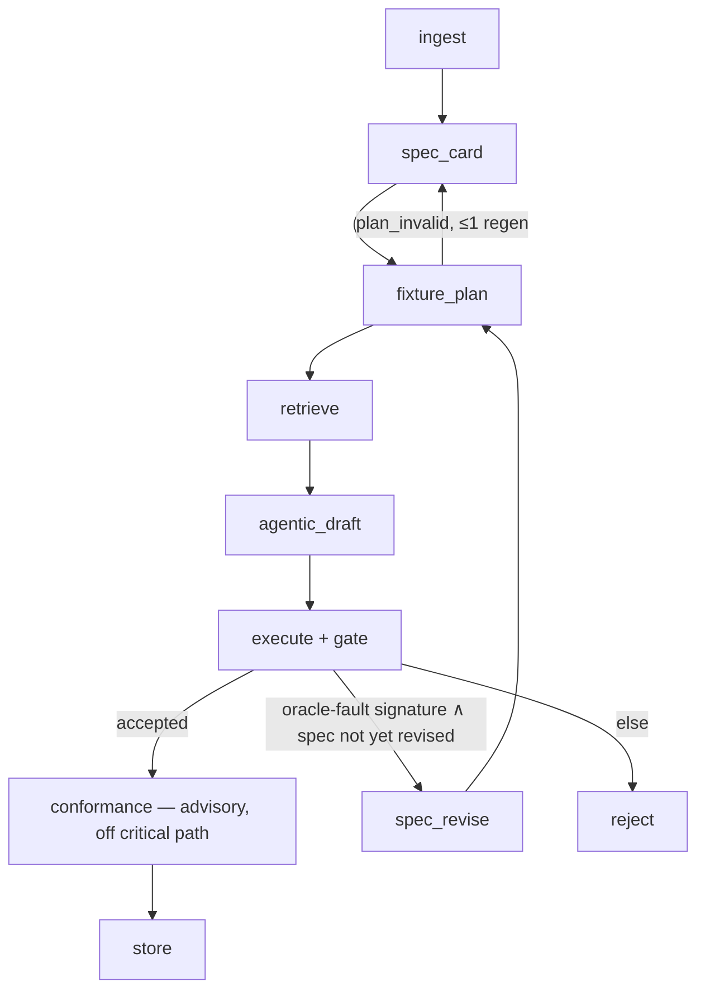

# FIV v3 Architecture — One Drafter, One Oracle, One Loop

**Status:** accepted design (2026-07-16), implemented same day — v3 is the wired pipeline; the v2 multi-drafter/consensus pipeline is preserved at git tag `v2-multidrafter` as the ablation arm.
**Scope:** this document records (i) the forensic evidence from running v2 on new rules, (ii) a literature review grounding every design decision, and (iii) the complete v3 architecture and migration map.

> **Reading note (2026-08-11).** This is a design record, kept as written. Two
> things have since moved on, and the sections below still describe them as of
> the v3 decision:
> - **The repair loop is gone.** The bounded whole-module repair stage
>   (`MAX_REPAIR_ROUNDS`) was superseded by the agentic drafter session
>   (§ v3.3 / [AGENTIC-LOOP-DESIGN.md](AGENTIC-LOOP-DESIGN.md)), which
>   iterates inside one conversation under `AGENT_MAX_TURNS`. `repair.py` and
>   the standalone draft node no longer exist.
> - **Model access is provider-agnostic.** OpenRouter-specific plumbing was
>   replaced by `bnbc/llm/`, which serves Gemini (multi-key pool, key and
>   model rotation) and OpenRouter behind one interface. Where the text says
>   "OpenRouter", read "the active provider".
>
> The current layout and configuration surface live in
> [../README.md](../README.md).

---

## 0. Executive summary

v2 generated checking code with **K parallel drafters** (2 models × 2 prompt framings), an **execution-consensus selector**, and a bounded repair loop, all gated by the Fixture-Injected Verification (FIV) engine. On the first genuinely new rule after the pipeline was hardened (8.3.4.2), all four candidates died for reasons that had *nothing to do with candidate diversity* — a spec-card convention silently made every fixture `not_applicable`, two drafts failed code extraction, and the survivors were discarded for "no progress" on a verdict vector that was frozen by construction. The multi-drafter/consensus layer added cost and failure surface while providing no signal the fixture gate did not already provide.

v3 keeps everything that earns its place — **spec card → fixture plan → deterministic gate → bounded repair** — and removes everything that does not: parallel drafting, the property-first framing, and the consensus node. The thesis, which is also the paper's thesis:

> **A manufactured executable oracle (violation-injection fixtures) turns open-ended code generation into test-driven search. Given that oracle, a single drafter with a bounded, evidence-grounded repair loop is sufficient — and Pareto-dominant over candidate ensembles.**

The literature strongly supports this: iterative self-repair with *external* execution feedback matches or beats compute-matched resampling while using 11–54 % fewer tokens; most repair gains land in the first two rounds; simple pipelines dominate complex agent architectures on cost-controlled evaluations; and the dominant failure modes of multi-agent systems are exactly the specification/coordination classes we observed. v3 also adds the two mechanisms the 8.3.4.2 failure proved necessary: **spec–fixture consistency validation** (conventions may not render the oracle unsatisfiable) and a **bounded outer spec-revision loop** for failures the code-repair loop provably cannot fix.

---

## 1. Evidence from this repository

### 1.1 What v2 actually runs

The wired graph (`bnbc/agent/graph.py`) is:

```
ingest → spec_card → fixture_plan → retrieve → draft(K∥) → execute → consensus → conformance ─┬→ store
                          ↑______________|                      ↑                             ├→ repair ─→ execute
                       (plan_invalid, once)                     |_____________________________|
                                                                                              └→ reject
```

Documentation drift already points at the problem: `README.md` and `IMPLEMENTATION_PLAN.md` (decision D3′) specify **K = 2**, but `config.K_CANDIDATES` defaults to **4** (`bnbc/config.py:57`) — the cross-product of 2 models × 2 framings (`drafting.py:25,100-117`). The running system is heavier than its own documented design. The `consensus.py` module docstring concedes its clustering is "dead weight" at small K. Simplifying to one drafter is not a departure from the design record; it is the limit of the direction the design record was already moving.

### 1.2 Forensics: rule 8.3.4.2 (rejected), commit `fca7fe2`

`rules/8.3.4.2/rejection.json` records terminal status `consensus_empty` — *no live candidates survived drafting/execution*. Decomposed, four distinct failure modes killed four candidates, and **not one of them is addressed by having more candidates**:

| # | Observed failure | Mechanism | Would K=8 have helped? |
|---|---|---|---|
| F1 | Every scored fixture returned `not_applicable` where `fail`/`pass` was expected (all 25 outcomes, all candidates) | The spec card's `special_moment_frame_identification` convention declared the rule `not_applicable` unless elements are *explicitly tagged* SMF — and no fixture carries that tag. The spec poisoned its own oracle; checkers were correct *per spec* and doomed *per gate*. | No. Every candidate implements the same spec; the defect is upstream of drafting. |
| F2 | 2 of 4 drafts produced no parseable Python ("no usable draft") | An 8-condition rule overran clean fenced-code output; extraction failed and the candidate was discarded without feedback. | No. Correlated with prompt size, not sampling. |
| F3 | Surviving candidates discarded for "repair made no behavioural progress (fixture pass-vector unchanged)" | The verdict vector was frozen by F1 — `not_applicable` is an *applicability* decision, unreachable by local code edits. Repair had no gradient. | No. The gradient does not exist at the code level. |
| F4 | Static-gate noise: `silent try/except-pass handler detected` | Drafters wrote defensive `except: pass`; the AST gate (`execution.py:145-151`) rejects it — but the drafting prompt never stated that constraint. | No. Every drafter trips a gate it was never told about. |

Contrast: 8.1.2.1.A (single-condition, commit `8d87466`) was accepted cleanly, as were the two validated rules on 2026-07-12. **The pipeline's marginal failure mode is not "the drafter was unlucky"; it is "the spec–fixture–prompt contract broke on a bigger rule."** That is a systems defect with systems fixes (§4), not a sampling defect with sampling fixes.

### 1.3 What the consensus layer was actually doing

Across every accepted rule to date, consensus selected by `(accepted, kill_rate, runtime)` — i.e., it re-read the gate's own scores. It never adjudicated a disagreement the gate could not resolve, because **the gate is a deterministic oracle: when it accepts, the disagreement report is moot; when it rejects everything, consensus has nothing to select.** An ensemble selector earns its keep only when the selection signal is weaker than the generation signal (majority voting over noisy answers). Here the selection signal is a manufactured ground truth. The ensemble was solving a problem FIV had already solved.

Cost note: K=4 parallel drafts multiply draft-stage tokens ~4× per round; the accepted 8.1.2.1.A/B runs spent $0.12–0.15 per rule at K≤3 — draft fan-out is the second-largest line item after nothing (v2 already killed the v1 verifier that consumed 94–99 % of tokens). K=1 removes it.

---

## 2. Literature review

Each subsection ends with the design implication it licenses. Full citations in §8.

### 2.1 Does candidate parallelism + consensus help when you have an executable oracle?

- **AI Agents That Matter** (Kapoor, Stroebl, Siegel, Nadgir & Narayanan, NeurIPS 2024) shows state-of-the-art complex agent architectures on HumanEval **do not outperform simple retry baselines**, at costs differing by up to two orders of magnitude; they argue for joint cost–accuracy (Pareto) evaluation. Our own v1→v2 forensics replicated this locally (2.1 M-token vacuous acceptance vs 90 K-token verified acceptance).
- **Why Do Multi-Agent LLM Systems Fail?** (Cemri et al., 2025; the **MAST** taxonomy over 1,600+ annotated traces, 7 frameworks) finds 14 failure modes clustered in *specification issues*, *inter-agent misalignment*, and *task-verification* — and that these, not insufficient agent count, dominate breakdowns. Our F1 is a textbook specification failure; F3 is a verification-design failure; `consensus_empty` is an inter-stage misalignment artifact. MAST predicts exactly the failure classes we logged.
- **Agentless** (Xia et al., 2024) showed a fixed three-phase pipeline (localize → repair → validate) outperforming autonomous multi-step agents on SWE-bench at a fraction of the cost; **mini-SWE-agent** (SWE-agent team, 2025) reaches >70 % on SWE-bench-Verified with a ~100-line linear-history agent. Structure and verification, not orchestration, carry the result.
- Majority voting/self-consistency does not transfer to code: textual majority voting fails because equivalent programs are textually disjoint (**Universal Self-Consistency**, Chen et al., 2023); execution-grounded variants (**CodeT**, Chen et al., ICLR 2023; **Semantic Voting**, 2026) work precisely by *constructing a test-based oracle to vote with*. FIV already **is** that oracle, with manufactured labels rather than model-generated tests — the ensemble's prerequisite subsumes the ensemble.

**Implication (V3-D1, V3-D2):** with a deterministic acceptance oracle in place, K>1 drafting + consensus is redundant machinery on the accept path and dead weight on the reject path. Remove it; retain K>1 only as a paper ablation arm.

### 2.2 Does iterative repair work, and how much of it?

- **Teaching LLMs to Self-Debug** (Chen et al., ICLR 2024): execution feedback + rubber-duck explanation reliably improves code across benchmarks, without task-specific training.
- **How Many Tries Does It Take?** (2026, arXiv:2604.10508; 7 models, 3 families): iterative self-repair with error feedback improves *every* model tested (+4.9 to +30.0 pp); **the first two repair rounds capture 76–95 % of achievable gains**; compute-matched, **repair matches or exceeds resampling while using 11–54 % fewer tokens** (e.g. Llama-3.3-70B: 93.3 % pass@5 at half the tokens of resampling). Assertion-level logic errors remain the hardest class (~45 % repair success) — which is why the *quality of the feedback artifact* (our distilled fixture evidence) matters more than the number of attempts.
- The critical boundary condition: **LLMs Cannot Self-Correct Reasoning Yet** (Huang et al., ICLR 2024) — *intrinsic* self-correction (model critiques itself without external signal) degrades performance. Self-repair works **iff the feedback is external and grounded**. This is precisely the v1→v2 lesson: the LLM-judge verifier was circular and self-preferring; the fixture gate is external, executable, and adversarial. v3's repair loop inherits its soundness from the oracle, not from the model's self-assessment.
- **AlphaCodium** (Ridnik et al., 2024): a test-based, multi-stage *flow* — enrich the spec, generate tests first, then iterate code against them — lifted GPT-4 on CodeContests from 19 % to 44 % pass@5. Its architecture is spec-enrichment + test-first + repair — structurally the FIV pipeline, with our fixtures playing the role of its AI-generated tests but with *known* ground truth (injected violations) instead of guessed I/O pairs.

**Implication (V3-D3):** one drafter + bounded repair (cap stays at `MAX_REPAIR_ROUNDS = 3`; expected value is concentrated in rounds 1–2) is the compute-optimal configuration. Draft-extraction failures must *enter* the repair loop with feedback (F2) rather than discard the candidate.

### 2.3 Is a spec-formalization stage worth keeping?

- **Self-Spec** (2025) and the intermediate-formal-specification line (SpecGen 2024; "Teaching Code LLMs to Reason with Intermediate Formal Specifications", 2026) show model-authored specifications improve generation reliability *by disambiguating before generation*, and that specs double as oracles for checking and repairing implementations.
- In ACC specifically, rule interpretation is the acknowledged bottleneck (Eastman et al., 2009, through the 2026 PRISMA review of ACC across the building lifecycle): regulatory clauses are written for human interpretation, and ambiguity (e.g., is a hook's "extension" tail-only or tail+bend-radius?) must be resolved *somewhere* explicit, auditable, and versioned.

**Implication (V3-D4):** the spec card stays, unchanged in role: one structured generation, disk-wins override, interpretation decisions recorded as provenance. It is the artifact reviewers and adopters audit. What changes is that its **conventions become validated inputs to the fixture planner** (§4.2) instead of unchecked prose — the F1 fix.

### 2.4 Verification without labeled data (the oracle problem)

- The **oracle problem** (Barr et al., TSE 2015) is the central obstacle: without expected outputs, generated tests only catch crashes. **Metamorphic testing** answers it with relations between transformed inputs; **mutation testing** answers it by injecting known faults and measuring detection. FIV's violation-injection operators are mutation testing *lifted from code to data*: perturb a real IFC model with a known, self-verified violation, and the expected verdict is known by construction. `kill_rate` (fraction of expected-fail fixtures detected, `contracts.py:278-283`) is exactly a mutation score.
- This is now mainstream at industrial scale: **Meta's mutation-guided, LLM-based test generation** (2025–26) injects privacy-violating faults and requires generated tests to kill them — the same manufactured-ground-truth move, deployed for compliance.
- **Metamorphic prompt testing** (2024) and **property-based-testing bridges** (2025) validate LLM code without oracles but report that model-generated properties are frequently trivial or wrong — reinforcing that *deterministic, self-verified* fixtures (our `selfverify.py` re-measures every written fixture with an independent measurement path) are the strongest available signal.
- Domain reality check: the BNBC ground-truth dataset itself contains wrong labels (negative clear spacings labeled compliant) and label-fitted reference solutions (diameter gates, magic ratios). A labels-based oracle would *institutionalize* those errors; a fixtures-based oracle sidesteps them and is the only defensible basis for the paper's benchmark claims.

**Implication (V3-D5):** the fixture engine (planner → operators → self-verification → manifest → gate) is the load-bearing contribution and is retained in full. The gate remains the **sole** source of `accepted=True`.

### 2.5 Positioning within LLM-based automated compliance checking

- **LLM-FuncMapper / clause-to-function composing** (Zheng et al., arXiv:2308.08728; EAAI 2026): matches clauses to a fixed library of 66 atomic functions, then composes. Strong on semantic matching (+19 pp over fine-tuning), but bounded by the hand-built function library and thin on geometry.
- **LLM-driven code compliance checking in BIM** (Electronics 14(11):2146, 2025) and the 2025 LLM-ACC line (ScienceDirect S0926580525007472; floor-plan checking, 2026; MCP4IFC, 2025): sequential LLM stages that interpret rules and generate or invoke checks — validated, where at all, against *known models with established compliance status* or expert judgment. None manufactures an executable oracle; none has verdict semantics for missing data; none reports a kill-rate-style acceptance criterion.
- **CODE-ACCORD** (Sci. Data 2025) provides an annotated regulatory corpus for rule *formalization* but no execution-level verification.
- The 2026 PRISMA systematic review's headline: despite two decades of research, ACC "has not seen meaningful adoption," with rule interpretation and *trust in the generated rules* as the persistent blockers.

**Implication:** no prior ACC system closes the loop *generation → manufactured oracle → gated acceptance → bounded repair*. That closed loop — not orchestration width — is the novel, defensible contribution, and it is stronger when the generation side is minimal: every accepted checker's provenance is "one drafter, N≤3 evidence-grounded repairs, kill_rate = 1.0," which is auditable in a way "4 candidates, ensemble selection" is not.

---

## 3. Design principles (distilled)

1. **Oracle-first.** Spend engineering on the verification signal, not on generation diversity. Every `accepted=True` traces to the deterministic gate; no LLM ever grades acceptance.
2. **One artifact, one owner.** One spec card (interpretation), one fixture manifest (oracle), one candidate (implementation). No stage re-decides another stage's output; MAST's misalignment classes are eliminated structurally rather than mitigated.
3. **External feedback only.** Repair prompts contain distilled *executed* evidence (fixture outcomes, missed conditions/elements, tracebacks) — never model self-critique (Huang et al.), never conversation history.
4. **Every gate is a stated contract.** Any deterministic check the pipeline enforces (AST rules, verdict-schema rules, output format) must appear verbatim in the prompt that generates the gated artifact (F4 fix).
5. **Repair at the level of the fault.** Code-level evidence → code repair (inner loop). Oracle-level evidence (systematic verdict-class mismatch) → spec/fixture revision (outer loop, bounded at 1). Blind discarding is never a response to a diagnosable fault (F1/F3 fix).
6. **Bounded everything.** Every loop has a static cap; every LLM call is metered against `TOKEN_BUDGET_PER_RULE`; the terminal states are exactly `stored` and `rejected`, and `rejection.json` carries full evidence.
7. **Generic by construction.** No rule-id-conditioned logic anywhere: the operator vocabulary, selector DSL, verdict semantics, and prompts are rule-agnostic; per-rule knowledge lives only in data (spec cards, exemplars) — never in code paths.

---

## 4. The v3 architecture

### 4.1 Control flow



Linear, single-candidate, bounded outer loops. `agentic_draft` is an internal tool-calling session bounded by turns and budget. Worst-case LLM calls per rule: 1 spec + 1 spec-regen + 1 spec-revise + (agentic session turns) + 1 conformance.

### 4.2 Node-by-node specification

**`ingest`** — unchanged. Loads `rules/<id>/rule.json`; `test_cases` remain invisible to the pipeline (external evaluation only, `scripts/evaluate_v2.py`).

**`spec_card`** — unchanged in role (structured single call, disk-wins YAML, provenance `open_items`, no HITL), with one *new obligation on its output contract*:

> **Convention–oracle consistency (F1 fix).** Any convention or `open_item` resolution that gates applicability (e.g., "only if explicitly tagged X") must be *dischargeable by the fixture plan*: for every expected-`fail`/`pass` sketch, the applicability predicate must be satisfiable using declared operators (e.g., a `set_property`/tagging operator establishing X), and at least one `not_applicable` sketch must exercise its negation. This is validated mechanically in `fixture_plan`, not trusted from prose.

**`fixture_plan`** — the planner (`bnbc/fixtures/planner.py`) keeps all current validation (operator vocabulary, selector DSL, per-condition minimums: ≥2 fail incl. boundary, ≥1 pass; per-card ≥1 unknown, ≥1 not_applicable) and adds the consistency check above as a new `PlanningError` class with a defect list. The existing regenerate-once path (`route_after_fixture_plan`) already feeds `plan_errors` back into spec regeneration — the F1 defect becomes a *planning-time* rejection with feedback instead of a run-time mystery. Manifest building, operator self-verification (`selfverify.py`, independent measurement path, hard failure on mismatch), and spec-version caching are unchanged.

**`retrieve`** — unchanged: live `ifc_helpers` API reference from signatures/docstrings + lexical exemplar retrieval over accepted rules and seeds. (Embeddings remain out of scope; revisit only if exemplar count grows past ~100.)

**`agentic_draft`** — replaces `draft` and `repair` with a single tool-using LLM session (≤ `AGENT_MAX_TURNS` turns).
- **Tool-calling loop:** Uses tools `inspect` (read-only IFC probe against fixtures/models), `evaluate` (runs static/fixture gates and returns scorecard), and `run_on_real` (advisory run on real corpus models).
- **Bounds:** Bounded by turns, inspects, wall-clock, and context tokens.
- **Elitism:** The best candidate is preserved across iterations via the `best_candidate` state field.
- See `AGENTIC-LOOP-DESIGN.md` for the full design of the internal tool loop that replaced the external repair loop.
- `FRAMINGS` deleted; `DRAFTER_MODEL` singular; prompt embeds executor's static contract.

**`execute` + gate** — The `execute` node remains the sole acceptance authority by re-running the agent's final candidate from scratch. Unchanged mechanics (subprocess isolation, AST static gate, schema validation, real-model conformance runs).
- **Fault classification.** After a failed gate, classify the evidence before routing:
  - *oracle-fault signature*: ≥90 % of scored fixtures return the same wrong verdict **class** and the miss is systematic across conditions → route to `spec_revise` (once).
  - *else*: route to `reject` (the best draft is handed off to human intervention). The `execute` node NEVER routes to `repair` anymore, as the internal tool loop handles code-level evidence.

**`spec_revise`** *(new, bounded at 1 per rule)* — a structured call that receives the original spec card **plus the gate's classified evidence** ("every expected-fail fixture returned not_applicable; the convention `<name>` requires a tag no fixture establishes") and must emit a revised spec card resolving the inconsistency — either by weakening the convention or by adding sketches that discharge it. Re-enters at `fixture_plan` (full re-validation, manifest rebuild via spec-version cache miss, fresh draft). This generalizes the existing `PlanningError` regenerate-once mechanism from *plan-time* defects to *gate-time* defects, and is the single genuinely new mechanism in v3. Combined caps keep the worst case at 2 spec generations + 1 revision.

**`conformance`** — retained but **moved off the critical path**: it runs once, *after* gate acceptance, purely to attach an advisory review to provenance (decision D4's endpoint: blockers were already forbidden from vetoing the gate; now they also cannot route). Repair routing derives entirely from gate evidence. Model: keep a distinct family from the drafter (restore the documented third-family property; the current default duplicates the drafter's family — noted drift).

**`store` / `reject`** — unchanged: `rules/<id>/{checker.py, acceptance.json, prerequisites.json, provenance.json}` or `rejection.json` with full evidence. Provenance drops `framing`/ensemble fields, gains `repair_rounds_used`, `spec_revised: bool`, `fault_classifications: [...]`.

### 4.3 State & contracts

- `V2State.candidates: list` → `candidate: dict` (single). `consensus` slot deleted; `get_selected_candidate` (imported by 4 modules) reduces to a trivial accessor `get_candidate` in `state.py`.
- `V2State.best_candidate: dict` — keeps the best-scoring candidate across all tool-loop iterations for elitism (hands off the best draft on terminal rejection).
- `CandidateResult.framing` deleted; contracts otherwise untouched — **`Verdict` four-valued semantics, `AcceptanceReport.kill_rate`, `PrerequisitesManifest`, and the no-vacuous-pass validator are load-bearing paper contributions and do not change.**
- Config: `K_CANDIDATES` deleted; `DRAFTER_MODELS` → `DRAFTER_MODEL`; `MAX_SPEC_REVISIONS = 1` added; everything else (budgets, timeouts, reasoning effort) unchanged.

### 4.4 Failure-mode coverage (observed → mechanism)

| Observed in v2 (8.3.4.2) | v3 mechanism | Where |
|---|---|---|
| F1 convention poisoned the oracle | convention–oracle consistency validation at plan time; `spec_revise` at gate time | planner + new node |
| F2 unparseable draft discarded silently | extraction failure enters repair loop with format feedback | draft/repair |
| F3 no-gradient repair → blind discard | fault classification routes oracle-faults to `spec_revise`, not repair | execute routing |
| F4 undeclared static gate tripped | every deterministic gate stated in the generating prompt | prompts |
| `consensus_empty` terminal ambiguity | state unrepresentable: one candidate, evidence-carrying `rejected` only | graph |
| K=4 draft cost multiplier | K=1 | config |

---

## 5. Migration map

Delete / simplify (tag `v2-multidrafter` first — it is the paper's ablation arm, mirroring the `v1-baseline` tag):

| File | Action |
|---|---|
| `bnbc/agent/consensus.py` | delete; move `get_selected_candidate` → trivial accessor `get_candidate` in `state.py` (update imports in `graph.py`, `conformance.py`, `store.py`) |
| `bnbc/agent/prompts.py` | REMOVED; replaced by `agentic_draft.py` tool-calling session |
| `bnbc/agent/repair.py (removed)` | REMOVED; replaced by `agentic_draft.py` internal tool loop |
| `bnbc/agent/agentic_draft.py` | ADDED; internal tool-calling session (inspect, evaluate, run_on_real) |
| `bnbc/agent/fixtures_facade.py` | ADDED; facade for fixture generation and gate |
| `bnbc/agent/graph.py` | remove `consensus` and `repair` nodes; rewire `execute →{conformance, spec_revise, reject}`; add `agentic_draft` node |
| `bnbc/agent/execution.py` | collapse per-candidate loop (`:194-278`) to one candidate; add fault classifier |
| `bnbc/agent/spec_card.py` | add revision-call variant (shares `_regenerate_spec_card` scaffolding) |
| `bnbc/fixtures/planner.py` | add convention–oracle consistency validation (`PlanningError` subclass with defects) |
| `bnbc/config.py` | `K_CANDIDATES` out; `DRAFTER_MODEL` singular; `MAX_SPEC_REVISIONS = 1`; reviewer default → non-drafter family |
| `bnbc/contracts.py` | drop `CandidateResult.framing`; provenance fields per §4.2 |
| `bnbc/agent/state.py` | `candidates` → `candidate`; drop `consensus` |
| `tests/` | update `test_v2_pipeline.py` for single-candidate flow; add: consistency-validation unit tests, fault-classifier unit tests, spec-revision routing test |
| `README.md`, `IMPLEMENTATION_PLAN.md`, `paper/OUTLINE.md` | v3 wiring; consensus moves from method §3 to ablation RQ4 |

Kept verbatim: `bnbc/fixtures/{operators, selfverify, manifest, gate}`, `fixtures_facade.py`, `retrieval.py`, `llm.py` (TokenMeter, structured→raw fallback), `store.py` storage layer, verdict contracts, `scripts/run_v2.py` / `evaluate_v2.py`.

---

## 6. Generality, reliability, and the paper

**Generality.** v3 contains no rule-specific logic: the 19 accepted rules influence only *data* (exemplars, spec cards). The new mechanisms are defined over abstract properties — "conventions must be dischargeable by fixtures," "systematic verdict-class mismatch" — that apply to any clause, any chapter, and in fact to any *generate-checking-code-over-structured-data-without-labels* setting (the FIV generalization claim). Nothing in §4 mentions rebar.

**Reliability.** Failure is now always diagnosable: every terminal `rejected` carries a fault classification, and the three formerly-silent failure modes (poisoned oracle, lost draft, frozen vector) are either prevented at plan time or routed to the mechanism that can fix them. Determinism improves — one drafter at temp 0 with subprocess-isolated execution has exactly one stochastic surface (provider nondeterminism), which the repair loop absorbs, as the 8.1.2.1.B run demonstrated (4/7 → 7/7 in one evidence-grounded round). Reliability is *measured*, not asserted: pass^k over repeated runs is RQ3.

**Evaluation plan (unchanged RQs, sharpened arms).**
- RQ1 correctness: v3 vs single-shot, vs retry-without-evidence, vs v1, on dev/val/held-out splits.
- RQ2 cost: tokens/$ per accepted rule; v3 should Pareto-dominate v2 (K=4) trivially and v1 by orders of magnitude.
- RQ3 reliability: pass^3 per rule.
- RQ4 ablations, each a one-flag revert: **+consensus/K=4** (the `v2-multidrafter` tag), **−repair**, **−fixture gate** (LLM-judge), **−spec card**, **−spec_revise**, **−retrieval**.
- RQ5 generalization: held-out rules from other BNBC chapters, zero scaffold iteration, fault-classification distribution reported.

The strongest sentence this design lets the paper write: *every accepted checker was produced by one drafter, at most three evidence-grounded repairs, and accepted only by a deterministic oracle it never saw during drafting — and removing any single component measurably breaks it.*

---

## 7. Appendix — field-hardening ledger

Every defect found while running v3 on new rules, the architectural gap it
exposed, and the *generic* fix that closed it. Nothing here is rule-specific;
each fix strengthens an invariant. This ledger is primary evidence for the
paper's failure study, and the "gap" column is the roadmap for what the
architecture must guarantee by construction.

| # | Incident (rule, date) | Architectural gap exposed | Generic fix | Status |
|---|---|---|---|---|
| I1 | glm-5.2 structured spec call burned the full 65,536-token completion budget on reasoning, emitted zero content — twice, deterministically (8.3.4.2, 07-16) | Provider pathology: structured output + reasoning routes everything to the reasoning channel; only stops at the token wall | Spec-stage reasoning cap (`SPEC_REASONING_EFFORT`); spec model moved to a structured-reliable family; `reasoning: none` mapping available per stage | fixed |
| I2 | The 28-minute call sailed past the "600s timeout"; a second one ran 18 min | httpx timeouts are per-socket-read — a slow-but-alive generation is unbounded; the configured bound was an illusion | True wall-clock ceiling per call: `asyncio.wait_for` + `LLM_WALL_TIMEOUT_SECONDS`; wall timeouts fail fast, never trigger the raw fallback | fixed |
| I3 | Two failed calls (~135K tokens) were invisible to `TOKEN_BUDGET_PER_RULE` | Metering only ran on success — cost accrued on a path accounting didn't cover (v1's 12M-token bug class) | Failed structured calls and fallback attempts are metered before exceptions propagate; `LLM_MAX_COMPLETION_TOKENS` bounds any single generation | fixed |
| I4 | `reasoning.effort=medium` was ignored by the provider | Remote parameters are advisory; correctness must not depend on a provider honoring them | Hard local bounds (I2, I3) hold regardless of provider behavior | fixed |
| I5 | Fixture F02 requested `insert_hooked_bar(bend_angle_deg=0)` — self-verification correctly refused a hook that doesn't exist; terminal engine failure (8.3.4.2 run 3) | Operator parameter domains were unvalidated: a spec-authored degenerate param surfaced as a build crash instead of plan feedback | Operators validate their domains and raise `PlanningError` with guidance → routes into the bounded regeneration loop; new `insert_straight_bar` fills the vocabulary gap the degenerate params were compensating for | fixed |
| I6 | Spec card targeted `name_contains: "FIV joint splice"` — an element "a previous sketch" inserted; no such capability existed (8.3.4.2 run 4) | Prompt–engine contract drift: the prompt promised step chaining the engine didn't implement; and lap-splice conditions *inherently* need compound fixtures | Multi-step sketches: `FixtureStep` chains applied in order on one model, per-step validation, stale-expectation superseding (last step touching an element asserts about it); prompt rewritten to the real semantics | fixed |
| I7 | First draft reply for 8.1.6.5 contained no parseable code block | v2 discarded such candidates silently (forensics failure F2) | v3 re-draft branch: extraction failures enter the repair loop with format feedback | fixed (validated live) |
| I8 | Each rejected run surfaced ONE new defect class; plan-retry budget was a hardcoded single retry, so convergence required manual reruns | Loop bounds should be uniform, configurable counters — a boolean retry is an inconsistency | `MAX_PLAN_REGENS` (default 2) joins `MAX_REPAIR_ROUNDS` / `MAX_SPEC_REVISIONS` | fixed |
| I9 | Spec model adopted `steps` immediately — but kept filling the sketch-level `operator`, first echoing step 0 (run 5), then labeling with a *mid-chain* salient operator (run 6); each strictness iteration rejected benign plans | Schema strictness is itself a failure source. A field that cannot affect materialisation must never fail a plan (Postel's law at the LLM boundary) | `steps` fully determine the build; the sketch-level `operator` is inert when steps exist and is ignored | fixed |

**Design lessons distilled**
1. **Never trust a remote bound; enforce every bound locally** (wall clock, completion tokens, budget metering on all paths). A pipeline is only as bounded as its most optimistic assumption about a provider.
2. **Every deterministic contract must be validated at the earliest stage that can see it** — operator domains at plan time, not build time; prompt claims generated from the engine (the operator vocabulary already is; targeting/steps rules should follow).
3. **Rejected runs are cheap diagnostics when failure is structured**: runs 3–5 of 8.3.4.2 cost $0.02–0.05 each and each converted one latent engine gap into a validated generic capability. The architecture's value is that failures land as *named defect classes with feedback loops*, not mysteries.

| I10 | 8.3.4.2 (8 conditions ⇒ ~45 sketches) thrashed at the plan stage across runs 3–6: whole-card regeneration resampled 40 valid sketches to fix 5 defective ones, trading defect classes each cycle; dangling targets surfaced only at build time; every regeneration rebuilt every fixture | **Granularity mismatch**: rule-sized feedback loops applied to sketch-sized defects. Plans are programs — they need incremental repair, static analysis, and caching like any program | (a) **Sketch-level repair**: structured planner defects (`sketch_index` per record) → a targeted `SketchRepairs` call replaces/adds only the defective sketches, valid ones kept verbatim; (b) **plan-time target census**: base-model class/name census validates every target in seconds instead of minutes into a build; (c) **content-addressed fixtures**: unchanged (base, steps) chains reuse their built, self-verified file across card versions | fixed |

| I11 | v6 card chained insert→translate/copy; inserted synthetic bars carry no ObjectPlacement, so the build crashed terminally (8.3.4.2 run 7) | Operators were not closed under composition: an insert_* output violated the preconditions placement-based operators assume of real elements | Placement-based operators give placement-less elements an identity placement at the origin; composition closure is now tested | fixed |
| I12 | glm burned two 8.1.6.5 repair rounds on unparseable replies before recovering | Model health is a first-class failure class; no bounded response to a degraded provider existed | Drafter fallback chain: `DRAFTER_FALLBACK_MODEL` after `DRAFTER_PARSE_FAILURE_LIMIT` consecutive unparseable replies | fixed |

---

## 8. v3.2 — choke-point remediation pass (2026-07-17)

Implemented from the ranked findings in `DEEP-ANALYSIS-2026-07-17.md` (C1–C9,
plus the Code-Agent comparison). All changes are generic; 174 tests passing.

| Fix | Choke point | Mechanism | Where |
|---|---|---|---|
| C1 | Fixture verdicts on perturbed 4,300-element real models are guesses (8.3.4.2: 9/48 ok, kill 0.00, oracle-fault) | Synthetic compliant scenes: `insert_host_element` operator (extruded-rectangle IfcBeam/IfcColumn/IfcWall/IfcSlab), `host_name_contains` on bar inserts (IfcRelAggregates), spec prompt mandates `__synthetic__` bases for pass/fail sketches + exact-arithmetic scene recipe; real-model perturbations reserved for NA/unknown | `synthetic.make_host_element`, `operators/insert.py`, spec prompt |
| C2 | 48 fixtures for 9 conditions incl. 9 identical NA fixtures; no cap | Cross-condition dedup by (base, content-hash) with contradiction detection and expected-condition union; new minimums (≥1 fail/condition, boundary only ≤3-condition rules, ≥2 pass/card, shared unknown/NA); budget cap max(10, conditions+5) on the DEDUPED count; `SketchRepairs` gained removal (`index` + null sketch) | `planner.plan_fixtures`, `spec_card.SketchRepair` |
| C3 | Known-broken glm-5.2 was the default spec+draft model | deepseek-v4-pro default for spec AND draft; glm demoted to fallback; `.env`/`.env.example` cleaned of dead v2 keys | `config.py`, `.env.example` |
| C4 | Gate contracts unstated: GUID attribution (8.1.6.5 F00/F01 failed with CORRECT verdicts), unknown-vs-fallback inconsistency (F03/F04) | Violation-attribution contract stated verbatim in drafter + repair prompts; spec prompt: an unknown sketch must strip EVERY declared fallback source | `drafting.py`, `repair.py`, `spec_card.py` prompts |
| C5 | spec_revise-authored conventions crashed fixture_plan terminally at 0 tokens (both live rejections) | Per-fixture build/self-verify failures wrap as `FixtureBuildError` carrying `source_sketch_indices` → `PlanningError` with structured defects → bounded plan-regen loop; plan-time IFC-schema validation of `strip_attribute` attribute names (catches `IfcWall.Thickness` statically) | `manifest.py`, `fixtures_facade.py`, `planner._schema_attribute_exists` |
| C6 | 42 KB spec YAML (75% sketches) re-dumped into every regen/revise call; spec_revise re-emitted all 48 sketches (16K output tokens) | Regen/repair/revise prompts send spec-proper YAML + one-line sketch summaries + full YAML only for defective sketches; `spec_revise` returns a targeted `SpecRevision` patch (conventions/prerequisites replacement + sketch repairs), never a whole card | `spec_card.py` |
| C7 | Repair feedback: 39 near-identical bullets, 300-char error clips, unexplained GUIDs, 11× duplicate static errors | Failures clustered by signature with counts; ONE representative full error (1,500 chars); missed GUIDs annotated as "the elements the fixture perturbed"; static/schema errors deduped with ×N counts | `repair.distill_failures` |
| C8 | Drafter blind to actual model content | Census+digest base-model profile (class counts, unit scale, one sample element's attributes + pset keys) injected into the draft prompt; probe report on gate failure: fixture's independently-measured ground truth (`self_verification.measured`) vs the checker's own account (new `FixtureOutcome.checker_summary`) | `census.build_digest`, `retrieval.build_model_profile`, `gate._checker_summary`, `repair.py` |
| C9 | Terminal rejection delivered nothing | Every rejection with a candidate writes `partial/checker.draft.py` + `draft_summary.json` (unconditional), alongside the stricter verified-partial tier | `store._write_draft_artifact` |
| — | Irrelevant exemplar injection (hook checker for a stirrup rule, library of 1) | `TOP_K_EXEMPLARS=1` + `EXEMPLAR_MIN_SCORE=0.15` relevance gate | `retrieval.py` |
| — | Helpers-vs-static-gate churn: drafters wrapped total helpers in `except: pass` (11 static errors on 8.1.6.5) | Totality verified empirically and ADVERTISED (helper-reference header + prompt: "never wrap ifc_helpers in try/except"); `tests/test_helpers_totality.py` is the tripwire; Code-Agent field doctrine (no create_shape on rebar, unit double-scaling guard, overlap-not-containment, no label-fitted constants, O(n) precompute) folded into the drafter system prompt | `retrieval.helper_reference`, `drafting.py`, new test |

### 8.1 Same-day live-run incidents (8.3.4.2 evening runs) and fixes

| # | Incident | Gap | Generic fix | Status |
|---|---|---|---|---|
| I13 | Bulk sketch-repair structured call burned 22,351 reasoning tokens into the 32K completion cap and died terminally at $0.10 (reported as "0 tokens") | Removal decisions are not an LLM task; reasoning effort is advisory (deepseek burned 18K even at "low"); token accounting was lost through guarded exceptions | Planner AUTO-TRIMS over-budget plans deterministically (coverage-preserving, drops logged); `SPEC_REASONING_EFFORT` default "none" (spec outputs are data, not proofs); `call_llm` attaches meter snapshots to every exception + recovers usage embedded in provider length errors; guard persists `token_usage` on all failure paths; spec-stage repair failures degrade to whole-card regen inside the bounded budget | fixed |
| I14 | With reasoning disabled: spec card in 1.5 min, 11 self-verified fixtures, first-try parseable draft — but the drafter never implemented lap-splice detection across two independent drafts | `get_bar_directrix_points` is LOCAL-frame; the fixtures' lap offsets live in ObjectPlacement — cross-bar comparison of local directrixes finds no overlap | COORDINATE-FRAME TRAP doctrine in the drafter prompt: never compare directrix coords across bars; world-frame helpers (`get_bar_bbox_fast`/`get_bar_centroid_fast`/`get_bar_placement_fast`) for cross-bar geometry. Effect: first-draft gate score jumped 2/11 → 6/11 (better than the prior run's final state) | fixed (validated live) |
| I15 | Fresh spec card carried 2 oracle bugs: a pass-scene missing fc/fy psets (sound verdict is unknown) and an unknown-on-real-model expectation conflicting with the card's own applicability convention (NA wins) | Verdict-soundness rules missing two clauses | Spec prompt gained applicability-precedence ("a scene failing your applicability conventions is not_applicable no matter what data is missing") and pass-completeness ("compliant geometry with missing required data is unknown, not pass"); the card itself fixed on disk (disk-wins) | fixed |
| I16 | Whole-module repairs oscillate: 6/11 → 5/11 → 5/11 (regression despite a "don't break what works" list in the prompt) | The loop kept only the LAST rewrite; nothing enforced monotonicity | Elitism: `best_candidate` tracked by (fixtures_ok, kill_rate); repair restores the best after a regression; terminal rejection stores the BEST draft under `partial/` and tags `needs_human_intervention: true` — full automation with an honest human-handoff terminal state for infeasible rules | fixed |
| I17 | Fresh rule 8.3.5.1: spec model omitted `ifc_class` in nested step targets through TWO repair calls and a revision, burning the whole plan budget; separately, a revised card arrived at the planner with zero regen budget left and died terminally | Postel's law gap (the class is inferable from the sketch's own insert steps); plan-regen budget did not reset with the oracle | Planner infers the target class from the sketch's earlier inserted elements (defect only when not inferable); `spec_revise` resets `spec_plan_regens` (total bounded by (1+MAX_SPEC_REVISIONS)×MAX_PLAN_REGENS) | fixed |
| I18 | 8.3.5.1 columns built SIDEWAYS: the operator's column convention (plan-section × height) contradicted the natural beam-consistent reading the spec model used, and `operator_vocabulary` truncated docstrings to one line so the semantics never reached the model — every expected verdict poisoned | Operator parameter semantics must reach the model that authors the parameters; conventions must match the model's natural reading | `length_mm` is the AXIS extent for every member class (column = width×height section extruded vertically); vocabulary renders the full first docstring paragraph; orientation regression test | fixed |
| I19 | With sound geometry, three consecutive 8.3.5.1 oracles were still wrong: f'c read from a *material* pset the engine cannot author; constant 500 kN loads under an Ag-scaled 0.1·Ag·f'c trigger made pass/fail scenes inapplicable (the checker was RIGHT and the gate correctly refused); a kN-vs-N ambiguity sank one draft; a reasoning-disabled spec revision re-introduced the arithmetic bug it was fixing | Reasoning-off spec models are unreliable at cross-quantity scene arithmetic (and reasoning-on blows the completion cap on deepseek/glm — I1/I13); data-location and unit conventions are consistency surfaces like applicability | Spec prompt gained DATA-LOCATION consistency (required data must live where set_pset_property can put it: element psets) and RECOMPUTE-PER-SKETCH (quantity-dependent triggers re-evaluated per scene); residual arithmetic handled by the designed disk-wins human adjudication (2-minute card edit, `status: adjudicated`) — after which **8.3.5.1 STORED: 9/9 fixtures, kill_rate 1.00, FIRST DRAFT, zero repairs, $0.0117, 3.5 min — the first v3-architecture acceptance, on a never-before-attempted rule**. Open lever for full autonomy: a spec model with an enforceable thinking budget (`SPEC_MODEL`, e.g. gemini-2.5-pro) | fixed / stored |

**v3.1 simplification pass (2026-07-16, evidence-driven):** a component audit against this session's live runs removed what wasn't earning its place. (1) **The discard concept is gone** — it was multi-drafter residue: with one candidate, "discard" killed the rule while repair budget remained (observed live). No-change and no-progress repairs are now *evidence lines* fed to the next round; the rounds budget is the only loop bound. (2) **The conformance reviewer is env-gated, default off** — it cannot veto or route, and live runs showed it inflating style notes; one LLM call per accepted rule for output nothing consumes is noise. (3) **The initial draft call gained the fallback family** — a provider outage on the first draft no longer kills the rule (the fallback previously existed only inside the repair loop). Components audited and *kept* on evidence: spec card (disk-wins), planner validation + census, self-verification (caught two real bugs live), gate, distilled-evidence repair (8→6 failures across rounds live), oracle-fault→spec_revise (fired correctly on a rule it wasn't designed against), exemplar retrieval (no LLM cost), token/wall bounds.

**Decision record (2026-07-16, delegated):**
- **Implemented**: sketch-level plan repair; plan-time census; content-addressed fixture reuse; declarative `PARAM_DOMAINS` (+`DOMAIN_NOTE` guidance) validated by the planner; `set_pset_property` operator + `pset_value` self-verification (closes the predicted f′c/fy gap ahead of runs); drafter fallback chain; **partial-evidence storage** — on terminal rejection, conditions that passed all their fixtures are salvaged under `rules/<id>/partial/` as human work-product; `accepted=True` semantics and the retrieval index are untouched, so the gate's soundness claim is preserved.
- **Deferred, with rationale**: per-condition sketch generation (overlaps sketch-level repair; add only if repair proves insufficient on large rules); automated composite-rule decomposition (changes benchmark rule identity — an owner decision, not an engineering one); full condition-level *acceptance* (kept as evidence-only partial storage for the same reason).

**Design lessons distilled (continued)**
4. **Repair at the granularity of the defect** — the same principle that split code-repair from spec-revision applies inside the plan stage: one bad sketch must never force resampling forty good ones.
5. **Anything the pipeline treats as a program deserves program tooling**: fixture plans now have static analysis (census), incremental compilation (content-addressed reuse), and unit-scoped repair.

**Improvement backlog (not yet implemented)**
- Declarative operator param schemas (domain constraints on the operator class), so the *planner* rejects degenerate params before any model is opened — removes the build-time `PlanningError` special case.
- Render all engine-capability prose in the spec prompt from code (targeting rules, step semantics), eliminating the I6 drift class permanently.
- Operator-vocabulary coverage analysis against the full BNBC chapter list, so vocabulary gaps (I5) are found ahead of runs instead of by them (predicted next gaps: set-material-property operator for f′c/fy-dependent thresholds; set-bend-radius for 8.1.2.2).
- Drafter/spec model fallback chain: after N consecutive unparseable replies from one model, switch family automatically (8.1.6.5 burned two repair rounds on a degraded provider before recovering).
- Per-condition sketch generation (decompose the one large structured call into parallel per-condition calls) — next step if sketch-level repair proves insufficient for very large rules.
- Condition-level (partial) acceptance: store checkers with per-condition verified status so one hard condition doesn't block seven provable ones — a product-semantics change, needs an explicit decision.
- Automated composite-rule decomposition (8.3.4.2 is really 3 sub-rules; the corpus already splits rules manually as 8.1.2.1.A/B/C).
- Once ≥10 v3 rules have run: fit `MAX_*` defaults and the oracle-fault threshold from the observed distribution instead of judgment.

## 8. References

**Agent architectures & simplicity**
- Kapoor, Stroebl, Siegel, Nadgir, Narayanan. *AI Agents That Matter.* NeurIPS 2024. [arXiv:2407.01502](https://arxiv.org/abs/2407.01502)
- Cemri et al. *Why Do Multi-Agent LLM Systems Fail?* (MAST). 2025. [arXiv:2503.13657](https://arxiv.org/abs/2503.13657)
- Xia, Deng, Dunn, Zhang. *Agentless: Demystifying LLM-based Software Engineering Agents.* 2024. [arXiv:2407.01489](https://arxiv.org/abs/2407.01489)
- SWE-agent team. *mini-SWE-agent.* [github.com/SWE-agent/mini-swe-agent](https://github.com/SWE-agent/mini-swe-agent)
- Ridnik, Kredo, Friedman. *Code Generation with AlphaCodium: From Prompt Engineering to Flow Engineering.* 2024. [arXiv:2401.08500](https://arxiv.org/abs/2401.08500)

**Self-repair & feedback**
- Chen, Lin, Schärli, Zhou. *Teaching Large Language Models to Self-Debug.* ICLR 2024. [arXiv:2304.05128](https://arxiv.org/abs/2304.05128)
- *How Many Tries Does It Take? Iterative Self-Repair in LLM Code Generation Across Model Scales and Benchmarks.* 2026. [arXiv:2604.10508](https://arxiv.org/abs/2604.10508)
- Huang et al. *Large Language Models Cannot Self-Correct Reasoning Yet.* ICLR 2024. [arXiv:2310.01798](https://arxiv.org/abs/2310.01798)
- Madaan et al. *Self-Refine.* NeurIPS 2023. [arXiv:2303.17651](https://arxiv.org/abs/2303.17651) · Shinn et al. *Reflexion.* NeurIPS 2023. [arXiv:2303.11366](https://arxiv.org/abs/2303.11366)

**Ensembles & selection**
- Chen et al. *CodeT: Code Generation with Generated Tests.* ICLR 2023. [arXiv:2207.10397](https://arxiv.org/abs/2207.10397)
- Chen et al. *Universal Self-Consistency for LLM Generation.* 2023. [arXiv:2311.17311](https://arxiv.org/abs/2311.17311)
- *Semantic Voting: Execution-Grounded Consensus for LLM Code Generation.* 2026. [arXiv:2605.08680](https://arxiv.org/abs/2605.08680)

**Oracle problem, mutation & metamorphic testing**
- Barr, Harman, McMinn, Shahbaz, Yoo. *The Oracle Problem in Software Testing: A Survey.* IEEE TSE 2015.
- *Validating LLM-Generated Programs with Metamorphic Prompt Testing.* 2024. [arXiv:2406.06864](https://arxiv.org/abs/2406.06864)
- *Use Property-Based Testing to Bridge LLM Code Generation and Validation.* 2025. [arXiv:2506.18315](https://arxiv.org/abs/2506.18315)
- Meta Engineering. *LLMs Are the Key to Mutation Testing and Better Compliance.* 2025. [engineering.fb.com](https://engineering.fb.com/2025/09/30/security/llms-are-the-key-to-mutation-testing-and-better-compliance/)

**Spec-first generation**
- *Self-Spec: Model-Authored Specifications for Reliable LLM Code Generation.* 2025. [OpenReview](https://openreview.net/pdf?id=6pr7BUGkLp)
- Ma et al. *SpecGen: Automated Generation of Formal Program Specifications.* 2024. [arXiv:2401.08807](https://arxiv.org/abs/2401.08807)

**LLM-based automated compliance checking (ACC)**
- Zheng et al. *Translating Regulatory Clauses into Executable Codes via LLM-Driven Function Matching and Composing* (LLM-FuncMapper). EAAI 2026. [arXiv:2308.08728](https://arxiv.org/abs/2308.08728)
- *Large Language Model-Driven Code Compliance Checking in BIM.* Electronics 14(11):2146, 2025. [arXiv:2506.20551](https://arxiv.org/abs/2506.20551)
- *Leveraging LLMs for BIM-based Automated Compliance Checking.* Automation in Construction, 2025. [ScienceDirect](https://www.sciencedirect.com/science/article/pii/S0926580525007472)
- Hettiarachchi et al. *CODE-ACCORD: A Corpus of Building Regulatory Data for Rule Generation.* Scientific Data 2025. [arXiv:2403.02231](https://arxiv.org/abs/2403.02231)
- *MCP4IFC: IFC-Based Building Design using LLMs.* 2025. [arXiv:2511.05533](https://arxiv.org/abs/2511.05533)
- *Automated Compliance Checking Across the Building Lifecycle: Systematic and Semantic Review.* Automation in Construction, 2026. [ScienceDirect](https://www.sciencedirect.com/science/article/pii/S0926580526001007)
- Eastman, Lee, Jeong, Lee. *Automatic Rule-Based Checking of Building Designs.* Automation in Construction, 2009.
